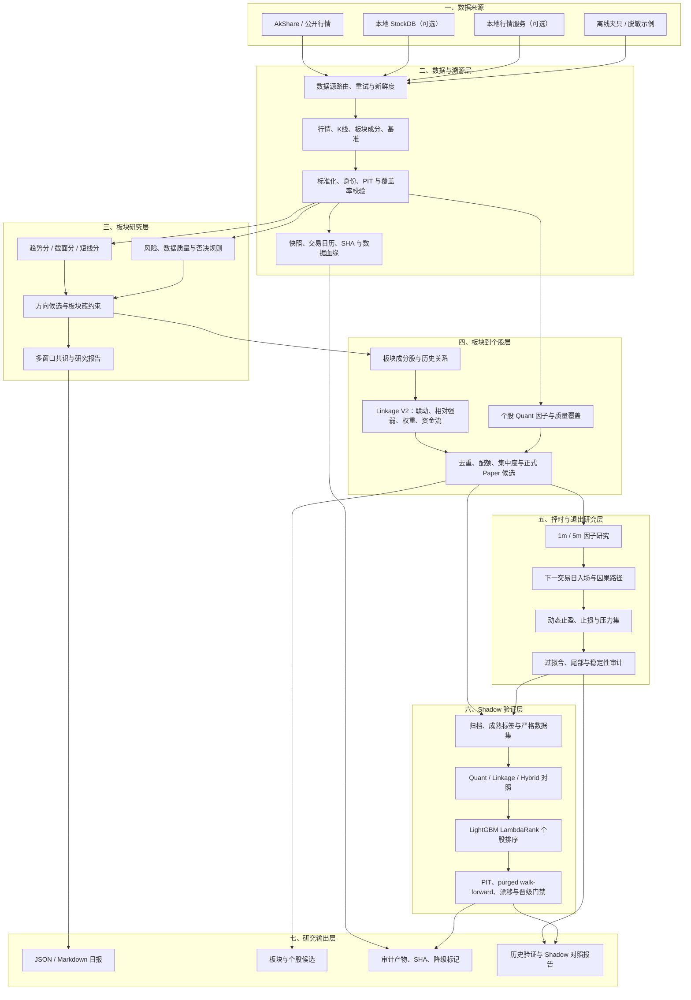

# A 股主题板块雷达

一个面向 A 股主题与行业轮动的研究型量化系统：从可追溯的数据输入开始，完成板块方向识别、板块内个股筛选、择时与退出研究、历史验证和 Shadow 模型对照。

## 准确定位

本项目当前是 **Paper/Shadow research system（纸面/影子研究系统）**，不是实盘交易系统。

- 不连接券商，不提交订单，不生成仓位指令。
- `formal_candidate_selection` 是研究候选集合，不是买入清单。
- 输出不作为个股操作依据。
- 所有新评分、Linkage、择时、止盈止损和 ML 结果都必须经过数据时点、样本量和晋级门禁。
- 缺失、过期、无法证明来源或无法证明 PIT（point-in-time）的数据会被标记、降级或 fail-closed。
- 研究结果不构成投资建议，也不承诺未来收益。

## 系统做什么

系统回答四个依次收紧的问题：

1. 当前哪些板块值得进入研究范围？
2. 板块内哪些股票真正与该板块方向具有关联？
3. 在同一候选池中，哪些股票更值得优先研究？
4. 入场、退出和 Shadow 排序证据是否足够支持下一步研究？

## 当前本地研究状态（如实说明）

本地研发工作树已经包含比公开基础版本更完整的实验链，但以下结果仍属于 Paper/Shadow：

- 方向分 → Linkage V2 → `formal_candidate_selection` 链已可运行。2026-07-16 的一次结果包含 1,029 条候选关系、554 只股票，最终保留 30 条研究候选；这不是生产晋级。
- Linkage V2 的 A/B/C 评估仍为 `insufficient_evidence`：历史成分股没有完成足够可靠的版本化，严格 PIT 证据和成熟 3/5 日标签不足。
- ML 支路采用 LightGBM LambdaRank 做候选池内的个股 Shadow 重排序，不负责选板块，也不决定买入、止盈或止损。当前只有 1 个历史重建日、0 个前瞻候选日和 0 个成熟 5 日标签日，因此真实训练被门禁阻止；合成训练仅用于验证软件链。
- 择时、非平稳入场、动态止盈、动态止损和压力集研究均保留保守结论；样本不足时保持 `observe`、`insufficient_evidence` 或 `not_evaluated`，不会包装成可交易策略。

## 总体架构



## 股票如何被选出来

```mermaid
flowchart LR
    A["研究日期"] --> B["冻结当日可见数据"]
    B --> C["校验行情、成分股、交易日历与来源"]
    C --> D["计算板块趋势 / 截面 / 短线 / 风险"]
    D --> E["生成方向候选板块"]
    E --> F["读取板块成分股与个股因子"]
    F --> G["计算 Linkage V2 与个股 Quant"]
    G --> H["排除身份、数据或关联证据不足的股票"]
    H --> I["按板块配额、去重与板块簇集中度约束"]
    I --> J["输出 formal Paper/Shadow 候选"]
    J --> K["未来标签、择时研究与 ML Shadow 对照"]
```



当前候选排序的研究逻辑是：板块方向先决定研究宇宙，Linkage V2 判断股票是否承接板块，Quant 分补充股票自身质量；ML 只在同一个候选池中做独立 Shadow 重排序，不覆盖受保护的正式评分字段。

## 数据层与可信度

数据流按 `as_of` 日期组织，并尽量绑定以下证据：

- 行情和板块成分来源、查询日期、最新可用日期。
- 版本化 A 股交易日历及其 SHA256。
- 候选源文件、标签文件、模型和报告的内容 SHA。
- 因子覆盖率、缺失因子、降级原因和数据质量状态。
- 历史评估的 PIT 证据、purge/embargo、训练/观察窗口与样本外资格。

如果无法证明“当时可见”，系统不会把回放结果称为严格 PIT；如果未来标签尚未成熟，系统不会把缺失标签当作负样本。

## 目录说明

| 路径 | 职责 |
|---|---|
| `theme_sector_radar/` | 核心包：数据、模型、评分、Agent、历史、回测、报告、择时和 ML Shadow。 |
| `scripts/` | 日常运行、候选导出、历史回填、择时研究、Linkage、ML 归档和审计 CLI。 |
| `tests/` | 数据契约、评分、候选链、PIT、paper-only、择时、退出和 ML 测试。 |
| `docs/` | 架构、运行手册、研究设计、结果和复现说明。 |
| `config/` | 可公开的配置示例，例如板块簇映射。 |
| `examples/` | 小型脱敏示例。 |
| `models/` | 仅保存可公开的合成/研究模型夹具，不代表真实策略效果。 |
| `data_cache/`、`reports/`、`test_output/` | 本地数据和生成产物，默认不纳入 Git。 |

`.planning/` 是本地协作过程材料，不属于公开源码发布内容。

## 安装与离线示例

```bash
python -m venv .venv
# Windows PowerShell: .venv\Scripts\Activate.ps1
pip install -e .[dev]
```

不接网络数据即可运行示例模式：

```bash
python scripts/export_top30_candidates.py --sample
python scripts/run_selection_validation_batch.py --mode sample --force
python -m theme_sector_radar.cli --daily --as-of 2026-06-28 --offline-fixture --fixture-profile full --lookback-days 5
```

真实数据模式需要用户自行配置 `.env`、AkShare/行情服务或本地 StockDB；真实数据、密钥和本地缓存不应提交到 Git。

真实日常运行示例：`python run_daily.py --as-of 2026-07-08 --provider akshare`。
日常报告写入 `reports/theme_sector_radar/<date>/`，并可包含 `run_log.json`；该目录是本地生成产物，不纳入 Git。

## 验证

```bash
python -m pytest tests/ -q
python -m compileall theme_sector_radar scripts
```

网络测试需显式启用；普通测试默认遵守离线/无网络策略。发布前应检查 `git diff --check`、严格 JSON、paper-only 合约和受保护评分字段扫描。

## License

MIT License，详见 [LICENSE](LICENSE)。
