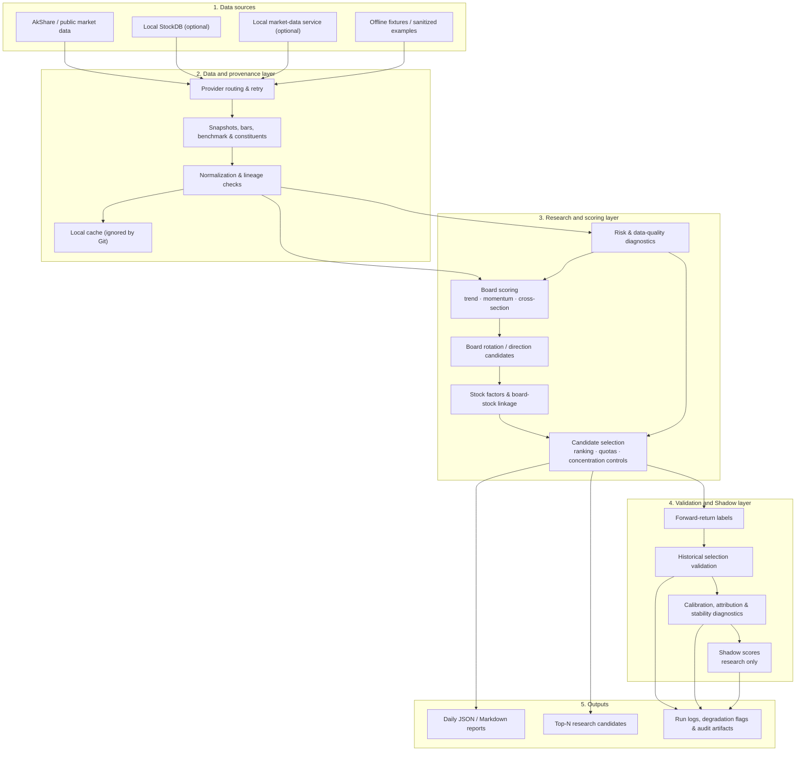
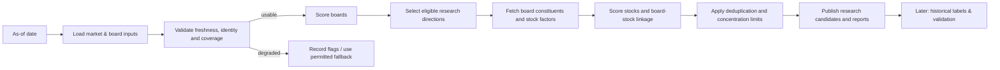

# A-Share Theme Sector Radar

> A research framework for A-share theme/sector rotation and stock-candidate analysis.

中文定位：面向 A 股主题与行业板块轮动的研究型分析框架。它将行情、板块成分、基准和因子数据组织为可审计的研究流水线，输出板块强弱、个股研究候选、数据质量标记和历史验证结果。

## Important boundary

This project is for research, education, and workflow automation only. It is **not** investment advice, a stock recommendation service, an investment advisory service, or an automated trading system. It does not connect to brokers, place orders, generate position instructions, or promise returns. All outputs require independent human review.

本项目仅用于研究、学习和工作流自动化；不构成投资建议，不生成买卖指令，不接入券商。候选股是后续研究对象，不是交易清单。

## What it does

- Scores A-share industry and concept boards to identify research directions.
- Builds a board-aware stock candidate pool instead of ranking the whole market indiscriminately.
- Evaluates momentum, trend, liquidity, valuation, volatility, drawdown, data quality and other factors.
- Produces structured JSON/Markdown reports for reproducible daily research runs.
- Validates candidate-selection methods against historical data and diagnoses failure modes.
- Runs experimental Shadow Score models separately from the protected baseline ranking.
- Supports optional agent-assisted diagnostics while preserving the research-only boundary.

## Architecture



### Research data flow



The pipeline is intentionally fail-aware: unavailable, stale, incomplete, or fallback data is recorded in outputs rather than silently treated as fully reliable.

## Repository map

| Path | Responsibility |
|---|---|
| `theme_sector_radar/` | Core package: data access, models, scoring, agents, history, backtests and reports. |
| `scripts/` | Command-line workflows for daily runs, exports, validation, calibration and diagnostics. |
| `tests/` | Pytest coverage for data contracts, scoring, pipelines and report schemas. |
| `config/` | Public configuration examples. |
| `docs/` | Runbooks, methodology, architecture notes and research documentation. |
| `examples/` | Small sanitized examples that are safe to share. |
| `reports/`, `data_cache/` | Generated/local artifacts; ignored by Git and not part of the public source distribution. |

## Current research snapshot

The following figures are a historical research snapshot, not a promise of future performance. The validation window covered 2026-01-05 to 2026-07-08 with 120 valid validation days. The strongest evaluated experimental model was V5 Regime Router Shadow Score:

- 120d Top-Bottom Gap: +4.59
- Hit Rate Diff: +56.0
- Spearman rho: +0.54
- Consistency: 55.0%
- broad_up gap: +0.07
- broad_down gap: +0.78
- mixed gap: +0.15
- Promotion Gate: `review_ready`

Important: `review_ready` means ready for human review. It does not mean `production_enabled`.

## Production vs Shadow Boundary

- `production_change_allowed = false`
- V5 is `shadow-only`
- Production weights were not changed
- Production ranking was not changed
- `review_ready` is not automatic production adoption

## Installation

```bash
python -m venv .venv
. .venv/Scripts/activate  # Windows PowerShell users can also activate manually
pip install -e .[dev]
```

Minimal dependency install:

```bash
pip install -r requirements.txt
```

## Quick Start: Sample Mode

Sample mode uses deterministic fixture/synthetic data. It does not require StockDB, market_data_service, API keys, or historical reports.

```bash
python scripts/export_top30_candidates.py --sample
python scripts/run_selection_validation_batch.py --mode sample --force
python scripts/evaluate_regime_router_shadow_score_v5.py --sample
```

Core board radar fixture mode:

```bash
python -m theme_sector_radar.cli --daily --as-of 2026-06-28 --offline-fixture --fixture-profile full --lookback-days 5 --report-root reports/theme_sector_radar
```

See [docs/sample_mode.md](docs/sample_mode.md).

## Real Data Configuration

Real data workflows may use AkShare, a local `market_data_service`, and optionally StockDB.

1. Copy `.env.example` to `.env`.
2. Set `MARKET_DATA_SERVICE_URL` if using the local HTTP service.
3. Set StockDB settings only if you have StockDB installed.
4. Keep `.env`, `data_cache/`, and `reports/` out of Git.

See [docs/open_source_data_policy.md](docs/open_source_data_policy.md).

## Daily Pipeline

```bash
python run_daily.py --as-of 2026-07-08 --mode fixture
python run_daily.py --as-of 2026-07-08 --provider akshare
python scripts/run_daily_unified_pipeline.py --as-of 2026-07-08
```

For production-like real data runs, confirm data source availability first and review all degradation flags. See [docs/runbook_daily_pipeline.md](docs/runbook_daily_pipeline.md).

Daily outputs are written under `reports/theme_sector_radar/<date>/`, including `run_log.json` when the daily runner records execution metadata.

## Top30 Candidate Export

```bash
python scripts/export_top30_candidates.py --as-of 2026-07-08 --stock-limit 30 --agent-stock-limit 10
```

Sample export:

```bash
python scripts/export_top30_candidates.py --sample --stock-limit 5 --agent-stock-limit 3
```

The export hides raw rank and is intended for research handoff, not recommendations.

## Historical Validation

```bash
python scripts/run_selection_validation_batch.py --start-date 2026-01-05 --end-date 2026-07-08 --mode existing-artifacts --source stockdb-sdk --force
```

See [docs/validation_methodology.md](docs/validation_methodology.md).

## Shadow Score / V5

V5 Regime Router Shadow Score routes between bull, defensive, and blended profiles by market regime. It is a research score only.

```bash
python scripts/evaluate_regime_router_shadow_score_v5.py --sample
```

For historical artifacts:

```bash
python scripts/evaluate_regime_router_shadow_score_v5.py --aggregate-path reports/selection_validation/aggregate/2026-01-05_to_2026-07-08/selection_validation_aggregate.json --validation-root reports/selection_validation --candidate-root reports/agent_bridge --output-dir reports/selection_validation/shadow_score_v5/2026-01-05_to_2026-07-08
```

## Project Structure

```text
theme_sector_radar/   core package
scripts/              command-line research utilities
tests/                pytest suite
docs/                 architecture, runbooks, methodology, phase reports
config/               example config files
examples/             small sanitized examples only
reports/              generated output, ignored by Git
data_cache/           local cache, ignored by Git
```

## Tests

Focused V5/open-source readiness checks:

```bash
python -m pytest tests/theme_sector_radar/test_defensive_shadow_score.py tests/theme_sector_radar/test_regime_router_shadow_score_v5.py tests/theme_sector_radar/test_shadow_v5_promotion_gate.py tests/theme_sector_radar/test_export_top30_candidates.py -q
```

Sample-mode checks:

```bash
python -m pytest tests/theme_sector_radar/test_export_top30_candidates.py::test_export_sample_top30_writes_demo_artifacts tests/theme_sector_radar/test_selection_validation_batch.py::test_run_sample_batch_writes_validation_artifacts tests/theme_sector_radar/test_regime_router_shadow_score_v5_evaluation.py::test_run_sample_evaluation_writes_shadow_v5_outputs -q
```

## FAQ

**Is this a stock recommendation system?**  
No. It is a research framework.

**Can I run it without StockDB?**  
Yes. Use sample mode and offline fixture mode.

**Does V5 replace production ranking?**  
No. V5 is `review_ready` and `shadow-only`, not `production_enabled`.

**Should I commit reports?**  
No. Full `reports/` and `data_cache/` are generated/local artifacts. Keep only small sanitized examples under `examples/`.

## Sponsorship

If this project helps your research workflow, you can support its maintenance. Sponsorship does not include investment advice, private stock recommendations, guaranteed support, or return promises.

## License

Add a project license before publishing publicly. MIT is assumed in `pyproject.toml` until replaced.
