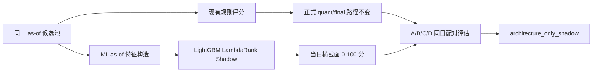

# 个股机器学习评分并行支路设计

## 定位

本支路只做 `paper_shadow_research_only`。它读取与规则评分相同的候选身份和 as-of 数据，独立输出 `ml_quant_score_shadow`，不写回正式候选，也不修改 `quant_score`、`final_score`、`v2_score`、`selection_score` 或 `selection_score_adjusted`。

第一阶段通过新 package 和独立 CLI 提供集成点。终审整改仅在 `unified_pipeline.py` 为 Linkage V2 Shadow 增加陈旧末根行情拒绝；`sector_stock_bridge.py`、正式评分公式和受保护字段不变。

## 模型

- 后端：可选依赖 LightGBM 4.x，目标为 `lambdarank`。
- 主连续标签：未来 5 个交易日个股收益减同期所属板块收益。
- 评估标签：未来 1/3/5 日个股收益和板块超额收益。
- LambdaRank 输入标签：连续标签只在每个交易日截面内转成 0-4 非负离散 relevance；原始连续标签保留给评估。
- Ranking group：样本先按 `(as_of_date, stock_code)` 排序，每个日期形成一个连续 group。
- 验证：按完整 as-of 特征宇宙做 expanding walk-forward，先排名再连接标签；purge 不少于最大 5 日 horizon，并要求每条训练标签的实际成熟日早于测试起点。每折 `min_train_dates` 按实际成熟、有标签的训练日期重算，不能用无标签特征日期补足，不允许随机 K-fold。
- 输出：原始 prediction 只用于审计，`ml_quant_score_shadow` 按当日截面映射到 0-100。

ML 依赖通过 `project.optional-dependencies.ml` 显式声明。依赖缺失、模型文件损坏、模型 SHA 不符、feature 顺序或 schema 漂移时直接输出 readiness/unavailable，不使用手写模型或固定 50 分降级。标签目标日必须来自 label source 中显式、排序且唯一的统一交易日历；停牌或板块缺 bar 时标签 unavailable，禁止顺延。

## 特征契约

V1 冻结 34 个有序特征：

- 1/3/5/10/20 日动量；
- MA5/10/20 距离；
- 5/20 日量比、5 日平均成交额；
- 5/20 日波动率、20 日最大回撤；
- PE、PB、市值及行业相对值；
- 板块趋势、短线和方向上下文；
- Linkage V2 共振、相对强弱、权重、资金流、数据质量组件；
- 数据质量、因子覆盖和缺失标志。

`quant_score` 和 `final_score` 只可进入规则对照，不是 V1 ML 特征。任何 `future_*`、`forward_*`、label 或 target 字段出现在 feature/predictor 输入时均拒绝。bars 可包含完整历史源，但 feature builder 只读取 `date <= as_of_date`，且最后一根有效 bar 必须等于 `as_of_date`；停牌或陈旧行情不能生成可排名特征。

## 模型身份

每个 bundle 固定包含：

- `model.txt`；
- `registry.json`；
- schema/feature SHA 和完整 feature 顺序；
- 标签定义和 relevance 编码；
- 训练起止日期、日期数、样本数；
- 受 SHA 约束的标签实际成熟区间、`model_available_from` 和数据分类；
- 只允许 `model_available_from` 至其后 45 个日历日的预测窗口；更早日期会因潜在未来信息泄漏 fail closed，更晚日期会因模型过期 fail closed；
- `synthetic_fixture` bundle 默认不能进入普通 Shadow 推理；
- LightGBM/numpy/pandas/sklearn 版本；
- dataset SHA、model SHA、registry SHA；
- 普通加载入口必须接收训练报告或受信 manifest 中的外部 expected registry SHA；registry 自报不能解除 `synthetic_fixture` 身份；
- 模型参数、全局 feature gain；
- `strict_pit_eligible=false`、`eligible_for_oos_claim=false`、`promotion_allowed=false`。

## 评估契约

- A：规则分排序；
- B：ML Shadow 排序；
- C：规则准入后按 ML 排序；
- D：规则与 ML TopK 共振。

TopK 至少支持 10/20/30。完整预测池先排序，再按 horizon 连接标签并以排序前候选宇宙为覆盖率分母；行业集中度也按完整入选池计算，与标签可用性解耦。1 日序列计算最大回撤，重叠 3/5 日 forward return 不冒充净值路径；少于两个日期时换手率为 unavailable。指标还包括收益和超额、胜率、Spearman IC、最差日期和按股票代码计算的换手。feature drift 或市场状态数据未提供时必须显示 unavailable。

第一阶段固定 `promotion_status=architecture_only_shadow` 且 `promotion_allowed=false`。未来只有在预注册 3/5 日超额、胜率、回撤、换手、fold 稳定性、市场状态稳定性及严格 PIT 全部实现并通过后，才可另行讨论晋级。

## Unified 接入点

主流程未来只需在候选池完成后：

1. 对候选和原始上下文建立只读副本；
2. 用 `build_feature_row()` 生成独立 feature rows；
3. 用 `load_model_bundle()` 校验并加载模型；
4. 用 `predict_shadow()` 生成单独报告；
5. 将报告路径和 SHA 放进运行审计，不把 ML 字段 merge 回正式股票对象。

这一接入应由主智能体在其他并行改造稳定后统一完成。
